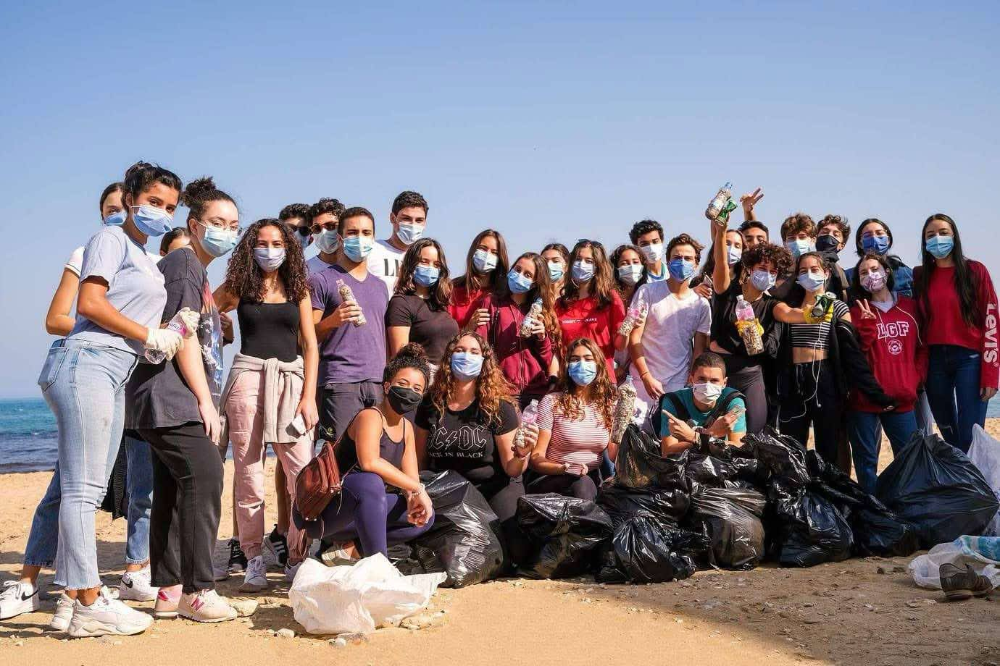

# My Story

I grew up mostly in Tunisia, but due to my father's work, we often had to move from country to country. You could say I was like an "oiseau migrateur" a migratory bird constantly discovering new cultures and meeting new people, only to say goodbye a year later. These experiences made me adaptable, resilient, and comfortable in any environment. I learned how to make friends quickly, even when we didn’t speak the same language. 😊

From a young age, I’ve also been a competitor at heart. I love sports and thrive in competition, whether it’s on the soccer field, volleyball court, or playing padel. I also enjoy competitive video games. I’m drawn to the challenge of improving every day, learning from each match, and performing under pressure.

My passion for technology started early too. After high school, I chose to study Computer Science because I wanted to create video games. In 2022, I moved to San Francisco and began studying Computer Science before transferring to San José State University to pursue a bachelor’s degree in Data Science.

Why Data Science? To be honest, I wouldn’t say I “love” it the way I love soccer, the gym, or traveling with friends. But I’m deeply interested and curious about it. I want to understand how data can solve real-world problems, and I enjoy learning and growing in this field.

I’m currently a junior, expecting to graduate in May 2026, and I’m actively seeking an internship in Data Analysis, Data Engineering, or Machine Learning. What I’m looking for is hands-on experience, an opportunity to learn, contribute, and grow as a future data scientist.

# Volunteer Activities
As a member of the UNESCO Club at Lycée Gustave Flaubert (LGF) in La Marsa, I actively participated in impactful community service and environmental initiatives. One memorable experience was organizing a beach clean-up at Gammarth Beach. Equipped with gloves and bags, our team of volunteers worked diligently under the morning sun, collecting litter and raising awareness among local beachgoers about the importance of preserving our coastline.
Wikipedia

In collaboration with Tunisian organizations, we also coordinated fundraisers to collect school supplies for underprivileged schools in regions like Aïn Draham. Visiting these schools to personally deliver notebooks, pens, and other essentials allowed me to witness firsthand the students' enthusiasm and gratitude. Additionally, we organized drives to gather winter clothing and food items, ensuring that vulnerable communities had the necessary resources during the colder months.

  
 

# LeaderShip Activities 
